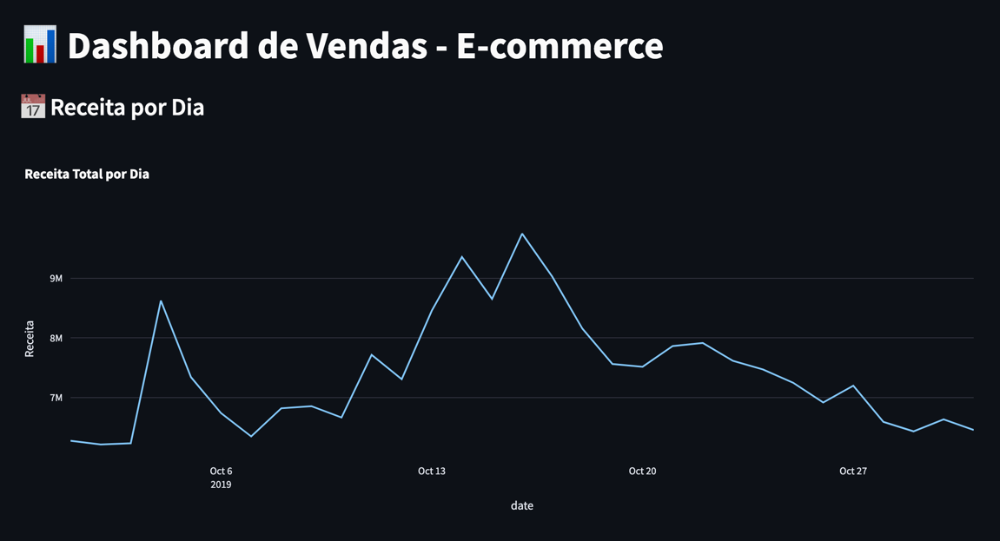

# 📊 Dashboard de Vendas com Python e Streamlit

Projeto de análise e visualização de dados de e-commerce, utilizando **Pandas**, **Plotly** e **Streamlit**.

---

## 🔍 Sobre

Este dashboard apresenta insights sobre o comportamento de compras em uma plataforma de e-commerce, permitindo ao usuário visualizar:

- 📅 Receita total por dia  
- 🏷️ Categorias mais vendidas  
- 🏢 Marcas com mais vendas  
- 📆 Receita por dia da semana  
- 🎛️ Filtros interativos por período

Os dados foram tratados com `pandas`, visualizados com `plotly` e entregues em um front-end leve com `streamlit`.

---

## 🧰 Tecnologias utilizadas

- Python 3.10+
- pandas
- plotly
- streamlit
- matplotlib / seaborn (na fase exploratória)
- Jupyter Notebook (opcional)

---

## 📦 Como executar o projeto

### 1. Clone o repositório

```
git clone https://github.com/seu-usuario/sales-dashboard.git
cd sales-dashboard
```

### 2. Crie e ative um ambiente virtual

```
python -m venv .venv
source .venv/bin/activate          # Linux/Mac
.venv\Scripts\activate           # Windows
```

### 3. Instale as dependências

```
pip install -r requirements.txt
```

### 4. Execute o Streamlit

```
streamlit run app.py
```

---

## 📸 Prints

> Adicione imagens reais do seu dashboard abaixo após rodar:

  
  


---

## 📁 Estrutura do projeto

```
sales-dashboard/
├── app.py                 # Dashboard interativo com Streamlit
├── prepare_data.py        # Script para tratamento inicial dos dados
├── data/
│   ├── 2019-Oct.csv       # Dataset original (opcional)
│   └── purchases_clean.csv  # Dataset já tratado
├── requirements.txt       # Dependências do projeto
├── README.md              # Documentação e instruções
└── assets/                # Imagens usadas no README (prints do app)
```

---

## 🌐 Deploy online (opcional)

> Publicado em:  
🔗 [Hugging Face Spaces]()  
🔗 [Render]()

*(insira o link aqui caso publique o dashboard online)*

---

## 📄 Licença

Este projeto está licenciado sob os termos da licença MIT. Veja o arquivo [LICENSE](LICENSE) para mais detalhes.

---

## 🙋‍♂️ Autor

Desenvolvido por **Seu Nome Aqui** – [LinkedIn](https://linkedin.com/in/seu-usuario)  
Contato: seu@email.com
